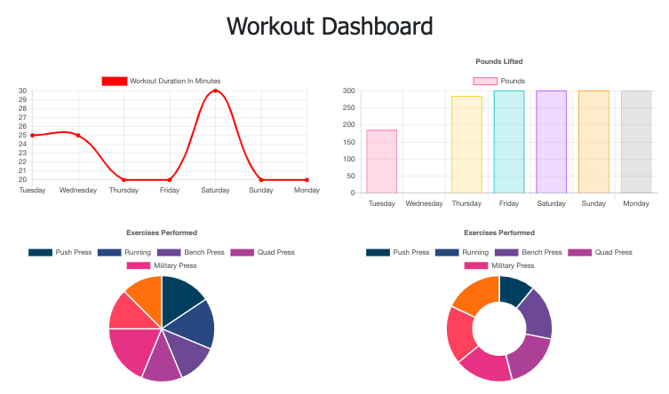
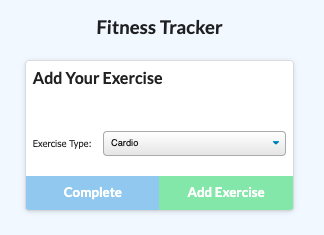

Workout Tracker
=============

## Description 
An app that allows you to create new workouts, update existing ones and track your progress over the past seven days.

## Installation
The app can be found on [Heroku](https://agile-dusk-71291.herokuapp.com/).
If you would like to fork it from the [Github repository](https://github.com/hkfernandez/Workout-Tracker) , just install the dependencies by running `npm i` then start the server on your local machine with `npm run watch`.

## Usage 
The user is prompted to create a new workout.
Follow the prompts to create a new workout by adding exercises to the workout.
When adding your final exercise, click complete instead of “Add Exercise”.
You can add exercises to the current workout or create a new workout.
In the navbar, you can select your dashboard to see your progress over time up to the past seven days. 

## Credits
I worked on the routes for this project connecting the fronted with the [mongo database](https://www.mongodb.com/). [Mongoose](https://mongoosejs.com/) was used to create the ORM. The server was created with [Express}(http://expressjs.com/). All code is Javascript on both the front and backend.

## License
MIT
